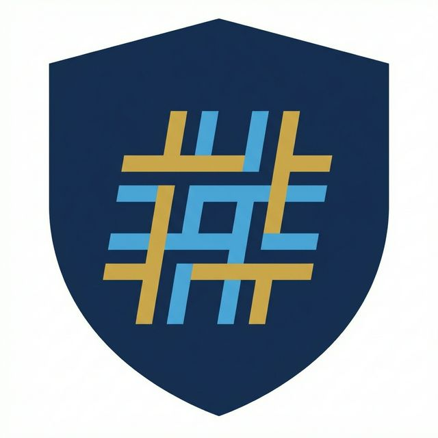

# HTAGravity

  

Here is a full rewrite of htag, using only antigravity and prompts.

It feels very good. It's not a replacement, it's just a POC.

It's completly crazy, but it works (for the basics, on linux only, and with "chrome app mode" only).

[DOC](https://manatlan.github.io/HTAGravity/)

## Get Started

Check the [Official Documentation](https://manatlan.github.io/HTAGravity/) for more information.

## Antigravity resumes :

HTAGravity is a Python library for building web applications using HTML, CSS, and JavaScript. It is a fork of the HTAG library, which is a Python library for building web applications using HTML, CSS, and JavaScript. HTAGravity is designed to be a more complete and feature-rich alternative to HTAG.